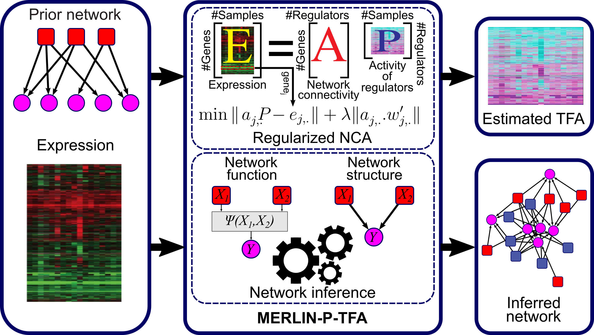

### MERLIN-P+TFA

MERLIN-P+TFA is a framework for network inference that combines estimated TFA and prior network to infer networks.

The steps are:
1. Estimating TFA
2. Inferring networks

### [Step 1] Estimating TFA

We use [EstimateNCA](https://github.com/Roy-lab/EstimateNCA) to estimate TFA. As input, we need and expression matrix and a prior network with edge confidence. Details can be found in [EstimateNCA](https://github.com/Roy-lab/EstimateNCA) repository.

We estimate TFA in multiple random initializations (we used 10 rand inits for yeast, and 100 rand inits for mammalian cell lines). We take average over rand inits, add a suffix to TF names (to separate expression regulators and TFA regulators) and concatenate these TFA profiles to expression matrix.

### [Step 2] Inferring networks

We use [MERLIN-P](https://github.com/Roy-lab/merlin-p) to infer regulatory networks. As input, we need an expression matrix (with or without TFA profile), a list of regulators, a list of target genes (optionally with initial cluster assignments), and a prior network (with edge confidence). 

We infer networks in a stability selection framework (see [Siahpirani & Roy NAR 2017](https://doi.org/10.1093/nar/gkw963)). Briefly, we use randpartitions_with_transpose_v2 in [merlin-auxillary](https://github.com/Roy-lab/merlin-auxillary) to create random subsamples (i.e. 100 subsamples, each with half the samples in original dataset), then infer a network from each subsample, then create consensus networks and consensus modules (using estimateedgeconf and assessclusterstab in [merlin-auxillary](https://github.com/Roy-lab/merlin-auxillary)).

If the expression matrix includes TFA regulators (with \_nca suffix) depending on downstream analysis we may need to collapse TFA and expression interactions to max confidence. 

### Datasets and Results

mESC datasets:
--------------

* Expression dataset: exp/
* Estimated TFAs: tfa/
* Gold standard networks: gold/
* Inferred networks: inferred/
* Inferred networks (TFA/Exp edges collapsed): inferred_collapsed/
* Motif prior network: prior.txt.gz

Yeast datasets:
---------------

* Expression dataset: exp.txt.gz 
* Estimated TFAs: tfa/
* Gold standard networks: gold/
* Inferred networks: inferred/
* Inferred networks (TFA/Exp edges collapsed): inferred_collapsed/
* Motif prior network: prior.txt.gz

Supplementary XLSX files:
-------------------------

* mESC samples: SF01_all_mESC_samples.xlsx
* mESC modules: SF02_mESC_modules.xlsx
* Yeast modules: SF03_yeast_modules.xlsx
* mESC network ranking: SF04_mESC_ranking.xlsx

